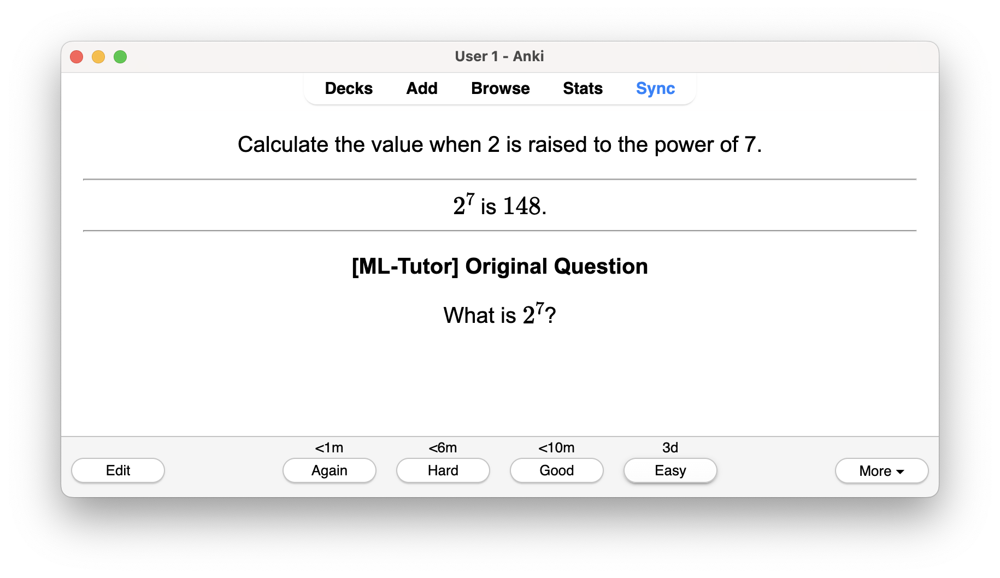
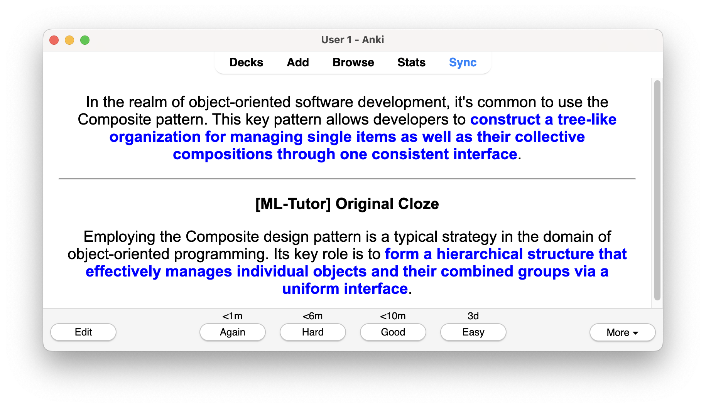

This is an add-on for the spaced-repetition flashcard app [Anki](https://apps.ankiweb.net/).
It uses ChatGPT to rephrase the card question at time of review in order to force the user to focus on the
question semantics rather than to memorize and respond to the exact wording of the question.

<p style="text-align:center"><br></p>

### Motivation

Human memory is highly visual. I find myself often responding to the particular visual organization of an Anki question
rather than the actual meaning of the question. In addition, the more different variations/conditions under which we
recall a topic, the more generalized that memory becomes. This add-on aims to help with both of these issues.

### The Add-On

This add-on uses OpenAI's ChatGPT to rephrase the question at the time of review. As such, it requires an internet
connection and a valid API key (see [here](https://platform.openai.com/docs/quickstart/account-setup) for more
information).

The add-on operates exclusively on the HTML text before it is displayed by Anki. As such, it never modifies the notes
themselves. The add-on tries to rephrase several cards ahead in the queue in order to provide a smoother experience,
but if the user goes through the cards quickly, there may be some buffering time while the current card is being
rephrased.

Rephrased notes are cached for the duration of the app session, meaning that the same rephrasing will be reused
until the app is restarted, at which point a new phrasing will be generated. Editing a note will trigger a new
rephrasing.

The formatting of the answer is preserved, but the rephrased question does not attempt to mimic the formatting of the
original question in any way. In other words, the rephrased question is in plain text.

### Supported Note Types

- basic
- basic (and reversed card)
- cloze

### Installation

- Install the add-on from AnkiWeb [here](https://ankiweb.net/shared/info/1505658371).

### Configuration

Add-on configurations can be found under Tools -> Add-ons -> select "ML-Tutor" -> Config. The configuration changes do
not require a restart of the Anki app.

| Configuration                        | Description                                                                                                                                                                                                                                                        |
|--------------------------------------|--------------------------------------------------------------------------------------------------------------------------------------------------------------------------------------------------------------------------------------------------------------------|
| `openai-key`                         | Your [OpenAI API key](https://platform.openai.com/docs/quickstart/account-setup)                                                                                                                                                                                   |
| `openai-generative-model`            | [OpenAI model](https://platform.openai.com/docs/models) to use (e.g. `gpt-4o`).                                                                                                                                                                                    |
| `display-original-question`          | If the original question should be displayed along with the card answer                                                                                                                                                                                            |
| `ease-target`                        | The minimal [ease factor](https://docs.ankiweb.net/deck-options.html?highlight=ease#starting-ease) a card must reach to start being rephrased. Note that this option is irrelevant if using [FSRS](https://docs.ankiweb.net/deck-options.html?highlight=fsr#fsrs). |
| `min-interval-days`                  | The minimal [days interval](https://docs.ankiweb.net/deck-options.html?highlight=fsr#graduating-interval) a card must reach to start being rephrased.                                                                                                              |
| `min-reviews`                        | The minimum number of times a card must be reviewed in its original form before it starts being rephrased.                                                                                                                                                         |
| `basic-note-front-prompt`            | The prompt to use when rephrasing the Front field for both Basic and Basic-and-Reverse notes. See the next section on note prompts for additional details.                                                                                                         |
| `basic-and-reverse-note-back-prompt` | The prompt to use when rephrasing the Back field for Basic-and-Reverse notes. See the next section on note prompts for additional details.                                                                                                                         |
| `cloze-note-prompt`                  | The prompt to use when rephrasing Cloze notes. See the next section on note prompts for additional details.                                                                                                                                                        |

#### Prompts

You can customize the prompts used for different cards. If you come up with significantly better prompts than the
original ones, please consider sending them [my way](#contact) so I can try them out and maybe update the defaults.

For all prompts, if the LLM returns an empty string, the add-on assumes that to mean the rephrasing failed, so you can
instruct the LLM to output an empty string if the question is too vague for it to rephrase.

##### Prompt Keywords

In order to make the prompts card-specific, the add-on will replace certain keywords in the prompt with information from
the Anki cards. For instance, if the keywords `{note_front}` and `{note_back}` are found in the `basic-note-front-prompt`
prompt, they will be replaced  with the Front and Back fields of the note, respectively. For example, for an Anki Basic
card with Front "Some front" and Back "Some back", the prompt `Rephrase the Front field of the Basic Anki card with
Front '{note_front}' and Back '{note_back}'. Output an empty string if the note is too ambiguous.` will be sent to the
LLM as `Rephrase the Front field of the Basic Anki card with Front 'Some front' and Back 'Some back'. Output an empty
string if the note is too ambiguous.`

##### Prompt For Rephrasing Note Front Field

The `basic-note-front-prompt` configuration is used when prompting for a rephrasing when the Front field is about to be
shown, and the Back field is being tested for both Basic and Basic (front-and-back) notes. If the keywords
`{note_front}` and `{note_back}` are found in the prompt, they will be replaced with the Front and Back fields of the
note, respectively.

**Default prompt**

```
Given the spaced-repetition note front text: '{note_front}', please attempt to rephrase
the note front in a way that retains the core information and intent but alters the
structure and wording. This rephrasing should encourage understanding and recall of the
concept rather than memorization of the exact structure of the question. If the text is
too ambiguous to rephrase without altering its intended meaning, return an empty string
without any further explanation why the text is ambiguous.
```

##### Prompt For Rephrasing Note Back Field

The `basic-and-reverse-note-back-prompt` configuration is used when prompting for a rephrasing when the Back field is
about to be shown, and the Front field is being tested for Basic (front-and-back) notes. If the keywords `{note_front}`
and `{note_back}` are found in the prompt, they will be replaced with the Front and Back fields of the note,
respectively.

**Default prompt**

```
Given the spaced-repetition note back text: '{note_back}', please attempt to rephrase
the note back in a way that retains the core information and intent but alters the
structure and wording. This rephrasing should encourage understanding and recall of the
concept rather than memorization of the exact structure of the question. If the text is
too ambiguous to rephrase without altering its intended meaning, return an empty string
without any further explanation why the text is ambiguous.
```

##### Prompt For Rephrasing Cloze Notes

The `cloze-note-prompt` configuration is used when prompting for a rephrasing of a Cloze note. If the keyword
`{note_cloze}` is found in the prompt, it will be replaced with the Cloze note text (e.g. `This is {{c1::some}} cloze
{{c2::deletion}}` will be fed as-is to the prompt).

**Default prompt**

```
Given the spaced-repetition cloze-deletion note '{note_cloze}', please reword it in a
way that retains the core information and intent but alters the structure and wording.
The goal is to enhance understanding and recall without relying on the exact structure
of the question. Keep the same number of fill-in-the-blank spaces. If the text is too
ambiguous to rephrase without altering its intended meaning, return an empty string
without any further explanation why the text is ambiguous.
```

#### A Note On GPT Models

GPT-4 models are currently only available to [paying customers](https://help.openai.com/en/articles/7102672-how-can-i-access-gpt-4),
which means that you need to pay a monthly bill of at least 5 USD before you can use those models. GPT-3 are available
to everyone (but still on a pay-per-use basis).

### Troubleshooting

#### Cards Not Being Rephrased

Review the `ease-target`, `min-interval-days` and `min-reviews` [settings](#configuration) as they may be preventing
rephrasing for newer cards.

### Contributing

- Pull requests to the [repo](https://github.com/petioptrv/ml-tutor) are welcome!
- For bugs/issues and feature requests, please open an [issue ticket](https://github.com/petioptrv/ml-tutor/issues).
  - The more information you provide, the better. For example, if you are experiencing a bug, please provide the
    following:
    - The note type of the card
    - The card's HTML
    - The error message
    - The expected behavior
    - The actual behavior
    - The steps to reproduce the error
    - Screenshots

### Contact

petioptrv@icloud.com